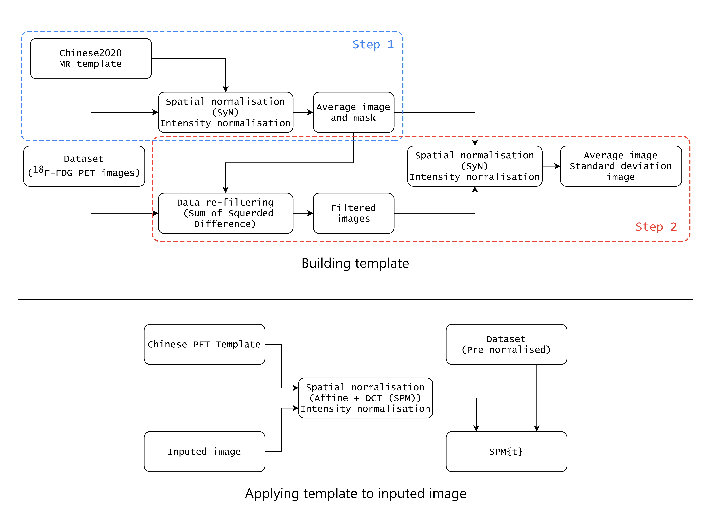

# 中国人PET脑模板

[English](./README.md) | 简体中文

这个仓库提供了中国人种专属的PET脑模板，还包括了模板的构建与使用的程序。本项目由 [大连理工大学医学影像研究组](https://biomedimg-dlut-edu.cn/) 基于 119 例正常中国人 <sup>18</sup>F-FDG PET 脑图像完成，并开源了全部数据以及程序。数据集部分存储在NITRC上，[Chinese Brain PET Template - NITRC](https://www.nitrc.org/projects/cnpet/) , 开放免费下载。

[](https://github.com/DlutMedimgGroup) [](https://github.com/DlutMedimgGroup)

## 安装

本项目使用了 MATLAB, [SPM](https://www.fil.ion.ucl.ac.uk/spm/), [SnPM](http://www.nisox.org/Software/SnPM13/), [Tools for NIfTI and ANALYZE image](https://www.mathworks.com/matlabcentral/fileexchange/8797-tools-for-nifti-and-analyze-image), Python3, [ANTsPy](https://github.com/ANTsX/ANTsPy) 以及其他一些库，并且已经在以下版本上完成测试。

> **Windows 10**
>
> - MATLAB R2018a
>
> - SPM 12
>
> - SnPM v.13.1.08
>
> - Tools for NIfTI and ANALYZE image v.1.27.0.0 
>
> - Python 3.7.3 64-bit
>
> **Ubuntu 16.04.6 LTS**
>
> - Python 3.8.3 64-bit
> - ANTsPy v.0.2.6

下载项目源码：

```
git clone https://github.com/DlutMedimgGroup/Chinese-Brain-PET-Template.git
```

## 使用说明



### 模板构建

使用 Python 程序文件夹下的 ``` ants_reg.py``` 配准所有数据，由于使用到了 ANTsPy 中的 SyN 方法，这一步需要在 Linux 或者 MacOS  下进行。

使用 SPM Masking toolbox 生成一个平均图像和一个 Mask，Mask 需要手动进行形态学调整，再次将所有原始图像配准到这个平均图像上。

对配准结果进行灰度归一化 ```normalisaton2mean.py```，并进行 SSD 分析 ```distance_analysis.py```，以排除有潜在代谢异常的数据。

根据筛选后的数据构建平均图像作为模板，同时获得标准差图像 ```create_template.py```，Mask 保持不变。

### 模板应用

为了方便用户使用我们提供的模板，我们提供了一个一键脚本用于分析输入的数据。脚本基于 MATLAB 编写，需要首先确保 MATLAB 中已有 SPM ，SnPM，Tools for NIfTI and ANALYZE image。运行时需要修改 [MATLAB](./MATLAB Scripts) 文件夹下的 ```main.m```，设置数据存放路径，即可执行，路径下不应该存放其他 NIFTI 格式的数据。

## 引用

如果我们的项目帮到了你，请引用：

```
coming...
```

## 使用许可

本项目使用 MIT 许可协议。

[]()